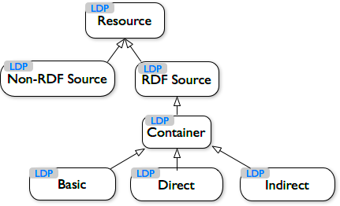
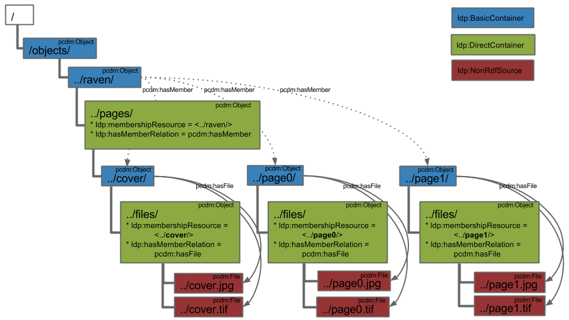

# Linked Data Platform (LDP)

- **Ontology:** http://www.w3.org/ns/ldp#
- **Model:** [`ldp.ttl`](ldp.ttl), [`ldp.json`](ldp.json), [`ldp.xml`](ldp.xml)
- **Specification:** https://www.w3.org/TR/ldp/
- **Vocabulary:** https://www.w3.org/ns/ldp
- **Wiki:** -
- **LOV:** https://lov.linkeddata.es/dataset/lov/vocabs/ldp

---

## Examples

### Fedora (LDP-PCDM-F4)

- [LDP-PCDM-F4 In Action](https://wiki.lyrasis.org/display/FEDORA471/LDP-PCDM-F4+In+Action):
    - [Book](https://wiki.lyrasis.org/display/FEDORA471/LDP-PCDM-F4+In+Action+-+Book)
    - [Collection](https://wiki.lyrasis.org/display/FEDORA471/LDP-PCDM-F4+In+Action+-+Collection)
    - [Ordering](https://wiki.lyrasis.org/display/FEDORA471/LDP-PCDM-F4+In+Action+-+Ordering)

